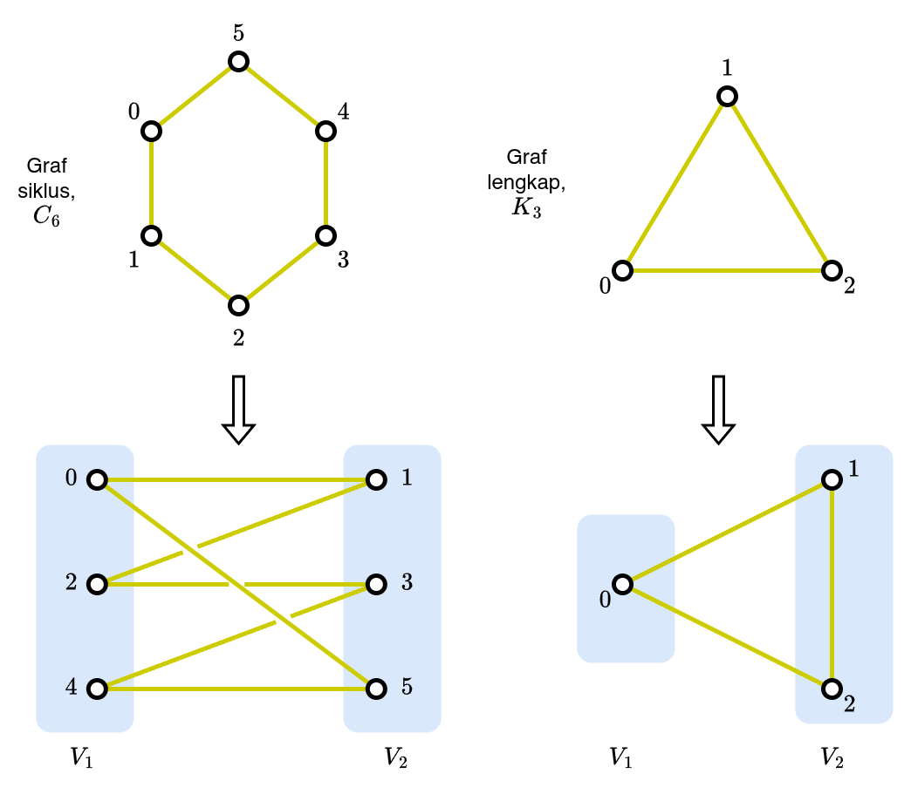
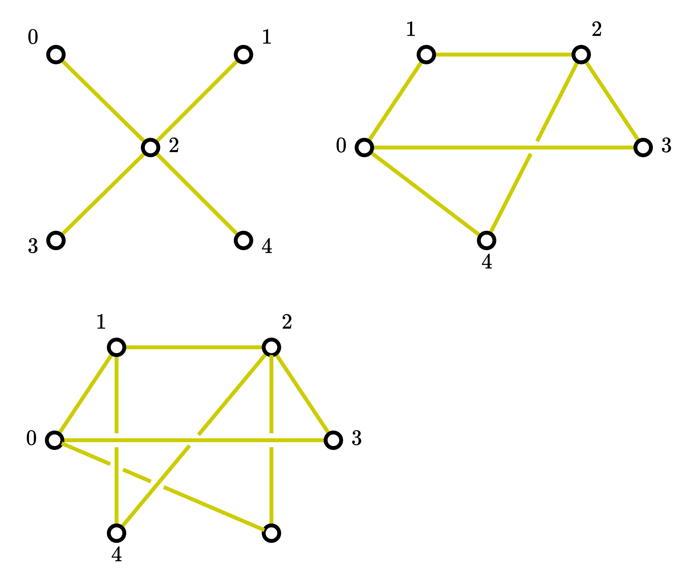
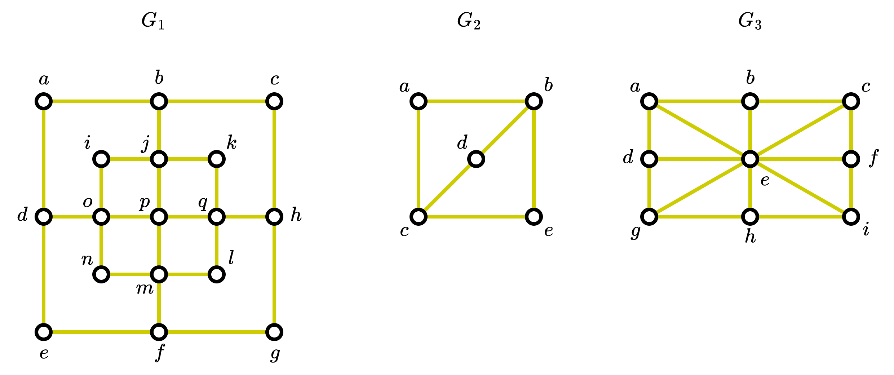
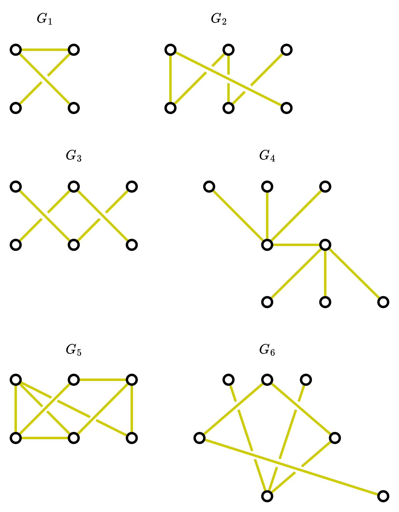
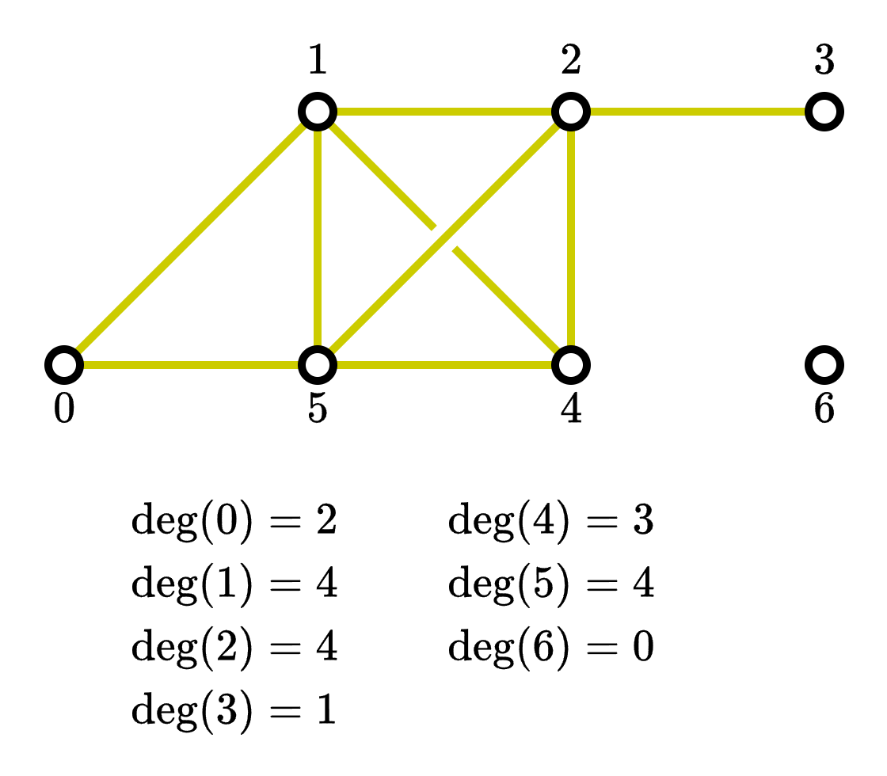
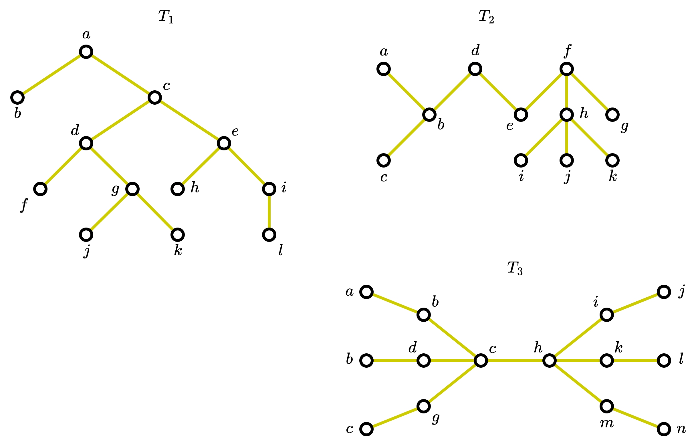

# Assignment 3

Silahkan memilih dua problem berikut untuk diselesaikan.

## Problem 1 (40 poin)

Suatu graf $G$ merupakan **bipartite** jika himpunan simpul-simpulnya, $V$
dapat dipecah menjadi dua himpunan $V_1$ dan $V_2$ sedemikian rupa 
sehingga setiap busur di graf $G$ tersebut menghubungkan 
satu simpul di $V_1$ dan satu simpul di $V_2$.

Lihat gambar di bawah ini untuk contoh graf yang merupakan _bipartite_
dan yang bukan _bipartite_

Di gambar sebelah kiri, graf siklus $C_6$ dapat kita pecah simpul-simpulnya 
menjadi dua himpunan $V_1$ dan $V_2$ dan semua busurnya hanya menghubungkan
dua simpul yang berasal dari dua himpunan berbeda. Tidak ada busur
yang menghubungkan dua simpul yang berada di dalam satu himpunan.
Sehingga graf siklus $C_6$ adalah _bipartite_.

Namun di gambar sebelah kanan, graf $K_3$ bukanlah _bipartite_
karena dengan cara apapun kita memecah menjadi dua himpunan $V_1$
dan $V_2$ (di gambar hanya ditunjukkan salah satu kemungkinan pemecahan, 
masih ada dua lagi sisanya yang tidak digambar), kita tidak akan bisa 
menyusun busur-busunya sehingga hanya menghubungkan dua simpul yang berada
di himpunan yang berbeda.

Dengan penjelasan di atas tentukan graf-graf berikut _bipartite_ atau bukan.
Sertakan juga alasannya

## Problem 2 (50 poin)

**Lintasan Hamilton** didefiniskan sebagai suatu lintasan sederhana di graf $G$
yang melalui semua simpul tepat satu kali, sedangkan **putaran Hamilton**
didefinisikan sebagai suatu putaran sederhana di graf $G$ yang melalui
semua simpul tepat satu kali.

Definisi yang lebih formal:
- lintasan sederhana, 
  $x_0 \rightarrow x_1 \rightarrow \ldots \rightarrow x_{n-1} \rightarrow x_n$,
  di graf $G = (V, E)$  adalah lintasan Hamilton jika 
  $V = \{x_0, x_1, \ldots, x_{n-1}, x_n\}$ dan 
  $x_i \neq x_j$ untuk setiap pasangan $i$ dan $j$ yang memenuhi 
  $0 \leq i < j \leq n$,

- putaran sederhana, 
  $x_0 \rightarrow x_1 \rightarrow \ldots \rightarrow x_{n-1} 
       \rightarrow x_n \rightarrow x_0$, 
  (dengan $n > 0$) adalah putaran Hamilton jika 
  $x_0 \rightarrow x_1 \rightarrow \ldots \rightarrow x_{n-1} \rightarrow x_n$
  adalah lintasan Hamilton.

Melalui definisi di atas tentukan apakah graf-graf berikut memiliki 
putaran Hamilton. Jika iya, maka tentukan putaran Hamilton tersebut.
Jika tidak, berikan alasan mengapa demikian.   

[Note: Alasan jika tidak ditemukan putaran Hamilton harus sejalan 
dengan pemahaman yang telah dipahami diperkuliahan. Apabila mendapatkan
istilah-istilah baru, maka istilah-istilah tersebut harus dijelaskan.]

## Problem 3 (30 poin)

Tentukan manakah graf berikut yang merupakan _tree_. Berikan juga 
alasannya menggunakan definisi _tree_ yang dijelaskan diperkuliahan

## Problem 4 (40 poin)

**Barisan derajat** dari suatu graf adalah barisan bilangan 
yang menyatakan derajat dari suatu simpul yang diurutkan nilainya
dari yang terbesar ke yang terkecil.
Sebagai contoh graf $G$ berikut memiliki barisan: $4, 4, 4, 3, 2, 1, 0$.

Tentukan **barisan derajat** dari graf-graf di Problem 1.

## Problem 5 (50 poin)

**Eksentrisitas** dari suatu simpul $v$ di suatu _tree_ $T$ yang bukan 
_rooted tree_ adalah panjang dari lintasan sederhana terpanjang yang dimulai
dari simpul $v$. Suatu simpul $v$ dikatakan **simpul pusat** jika
tidak ada simpul lain di _tree_ tersebut yang memiliki eksentrisitas
lebih kecil dari eksentrisitas simpul $v$.

Diberikan _trees_ berikut, tentukan simpul pusatnya.

