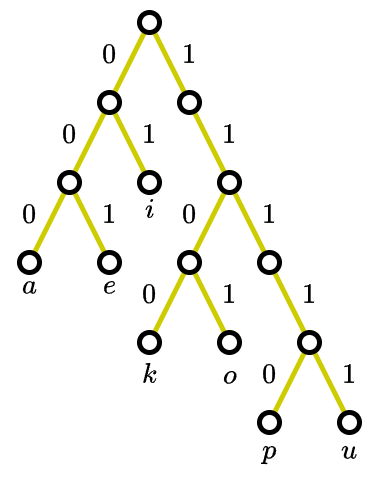

# Assignment 3

Silahkan memilih dua problem berikut untuk diselesaikan.

## Problem 1 (40 poin)

## Problem 2 (50 poin)

## Problem 3 (30 poin)

Seperti apakah kode untuk $a$, $e$, $i$, $k$, $o$, $p$, dan $u$
jika diberikan skema pengkodeannya diwakili oleh tree berikut

## Problem 4 (40 poin)

## Problem 5 (50 poin)

Susunlah kode Huffman untuk huruf-huruf dari alfabet bahasa Inggris
yang mana frekuensi kemunculan untuk tiap hurufnya dikamus diberikan
oleh tabel berikut

| Huruf | Frekuensi | Huruf | Frekuensi |
|-------|-----------|-------|-----------|
| $A$   | 0.0817    | $N$   | 0.0662    |
| $B$   | 0.0145    | $O$   | 0.0781    |
| $C$   | 0.0248    | $P$   | 0.0156    |
| $D$   | 0.0431    | $Q$   | 0.0009    |
| $E$   | 0.1232    | $R$   | 0.0572    |
| $F$   | 0.0209    | $S$   | 0.0628    |
| $G$   | 0.0182    | $T$   | 0.0905    |
| $H$   | 0.0668    | $U$   | 0.0304    |
| $I$   | 0.0689    | $V$   | 0.0102    |
| $J$   | 0.0010    | $W$   | 0.0264    |
| $K$   | 0.0080    | $X$   | 0.0015    |
| $L$   | 0.0397    | $Y$   | 0.0211    |
| $M$   | 0.0277    | $Z$   | 0.0005    |

