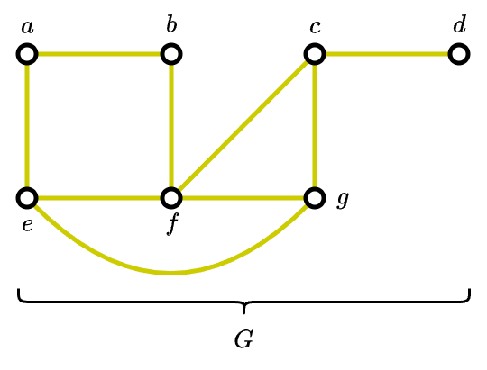
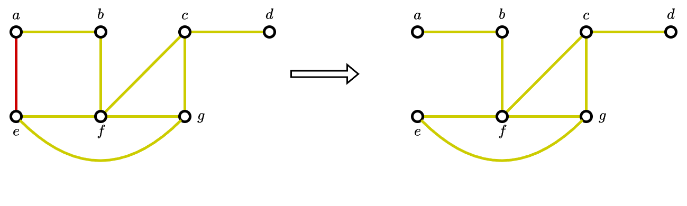
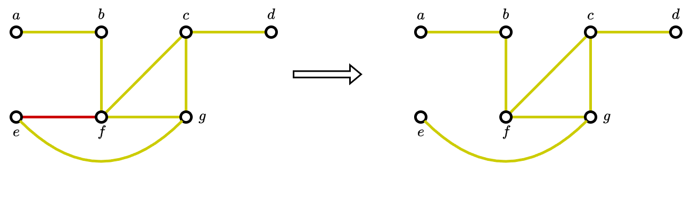
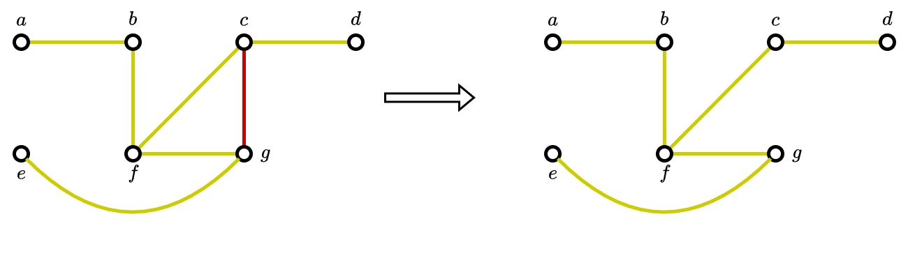
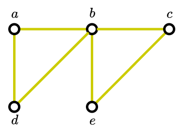
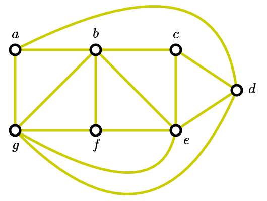

# Assignment 4

Silahkan memilih dua problem berikut untuk diselesaikan.

## Problem 1 (40 poin)

Suatu _tree_ disebut _tree ulat_ jika _tree_ menjadi
menjadi graf lintasan apabila _leaves_-nya dihapus.
Panjang lintasan di graf tersebut (setelah dihapus _leaves_-nya)
menunjukan panjang dari _tree ulat_.

Sebagai tambahan definisi, graf lintasan adalah graf yang simpul-simpulnya
satu sama lain saling terhubung membentuk suatu untaian. Untaian 
ini mirip seperti kalung tapi tidak terbentuk gelung. Yang berarti ada
dua simpul di ujung-ujung untaian yang memiliki derajat bernilai 1.
Sedangkan simpul-simpul lainnya memiliki derajat bernilai 2.

Carilah semua kemungkinan _tree ulat_ yang memiliki panjang lintasan 3.

## Problem 2 (50 poin)

Suatu _rooted Fibonacci tree_ $T_n$ didefinisikan secara rekursif sebagai berikut.   
Pertama kita memiliki $T_1$ dan $T_2$ berupa _rooted tree_ yang masing-masing hanya 
terdiri dari satu simpul, dan untuk $n = 3, 4, \ldots$, _rooted tree_ $T_n$
disusun dengan cara menyatukan _root_ dari $T_{n-1}$ sebagai _subtree_
sebelah kiri dan _root_ dari $T_{n-2}$ sebagai _subtree_ sebelah kanan.

<ol type="a">
<li> 

Gambarkan $T_1$, $T_2$, hingga $T_7$
<li> 

Berapa banyak simpul, _leaves_, dan simpul internal yang dimiliki 
oleh _rooted Fibonacci tree_ untuk $T_{100}$?
</ol>

## Problem 3 (30 poin)

Seperti apakah kode untuk $a$, $e$, $i$, $k$, $o$, $p$, dan $u$
jika diberikan skema pengkodeannya diwakili oleh tree berikut

## Problem 4 (40 poin)

Misalkan $G$ adalah graf sederhana. Suatu _spanning tree_ dari $G$
didefinisikan sebagai suatu subgraf dari $G$ yang berupa suatu _tree_
yang memuat semua simpul di $G$.

Sebagai contoh diberikan graf $G$ berikut

Graf $G$ diatas saling terhubung (tidak ada simpul yang terisolasi, $\deg(v) \neq 0$), 
namun graf diatas bukan _tree_ karena memiliki beberapa 
putaran sederhana, yaitu 
- $a \rightarrow b \rightarrow f \rightarrow e \rightarrow a$
- $e \rightarrow f \rightarrow g \rightarrow e$
- $f \rightarrow c \rightarrow g \rightarrow f$
- dan seterusnya ...

Dengan menghapus busur $(a, e)$, kita dapat mengeliminasi/memutus 
satu putaran sederhana. Graf yang dihasilkan masih terhubung (tidak
ada simpul yang terisolasi, $\deg(v) \neq 0$). 

 

Berikutnya kita hapus busur $(e, f)$ untuk mengeliminasi putaran sederhana.
Perlu diingat saat penghapusan busur pastikan semua simpul masih terhubung
(tidak ada simpul yang terisolasi, $\deg(v) \neq 0$)

 

Terakhir, kita hapus busur $(c, g)$ untuk mendapatkan graf sederhana
yang tidak memuat putaran sederhana.

Subgraf yang terakhir yang didapatkan ini adalah _spanning tree_ dari $G$.

[Catatan]: Untuk proses penghapusan busur yang berbeda akan membentuk 
_spanning tree_ yang berbeda.

Diberikan graf-graf sederhana berikut, carilah _spanning tree_ dari graf-graf
sederhana tersebut

<ol type="a">
<li> 

 
<li> 
</ol>

## Problem 5 (50 poin)

Susunlah kode Huffman untuk huruf-huruf dari alfabet bahasa Inggris
yang mana frekuensi kemunculan untuk tiap hurufnya dikamus diberikan
oleh tabel berikut

| Huruf | Frekuensi | Huruf | Frekuensi |
|-------|-----------|-------|-----------|
| $A$   | 0.0817    | $N$   | 0.0662    |
| $B$   | 0.0145    | $O$   | 0.0781    |
| $C$   | 0.0248    | $P$   | 0.0156    |
| $D$   | 0.0431    | $Q$   | 0.0009    |
| $E$   | 0.1232    | $R$   | 0.0572    |
| $F$   | 0.0209    | $S$   | 0.0628    |
| $G$   | 0.0182    | $T$   | 0.0905    |
| $H$   | 0.0668    | $U$   | 0.0304    |
| $I$   | 0.0689    | $V$   | 0.0102    |
| $J$   | 0.0010    | $W$   | 0.0264    |
| $K$   | 0.0080    | $X$   | 0.0015    |
| $L$   | 0.0397    | $Y$   | 0.0211    |
| $M$   | 0.0277    | $Z$   | 0.0005    |

