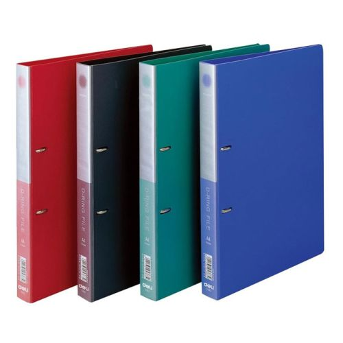

# Rules for portfolio assessment

To write any assignment, you need to follow strictly to all these rules.

1. Prepare a sheet of A4 paper. 
   Draw a margin with the size 1 cm around all the edges

   

   

    

      

        Full Name  
        DD/Mmm/YYYY
      
 
      Student ID
    

   

   

   Write your name and the student ID number as shown in the above figure.   
   You may include the date to the top right of your paper.
   You can use both sides of the paper.   
   Make sure to draw also the margin. If you submit your answer more than one sheets, please write the page number.   

   **You have to write your answers with a pen!**

   **Special case**: If you want to use 2-hole binder for organizing your
   writing, set the left margin into 1.5cm or 2cm (depending on your binder).
   Remember your binder must be accomodate A4 paper!

   <table>
   <tr>
   <td>
   
   </td>
   </tr>
   <tr>
   <td>
   2-hole binder
   </td>
   </tr>
   </table>

2. You do not need to use any correction fluid. If you have a mistake just
   strikethrough the words or sentences. Or you can throw away the paper
   and start out from the beginning.

3. In each week, you have to write at least two sheets (on both sides).
   Your portfolio assessment must contain the following parts
   - your notes during a class, and
   - three problems (easy, medium, and hard).   
     These level of difficulties are depending on your understanding
     and how long can you solved the problem.
     You have to write those three problems and also their answers.

     Easy problem can be solved around 5 minutes    
     Medium problem can be solved around 15 minutes    
     Hard problem can be solved around 40 minutes or more.

   For the problems, you can choose the problems from (Rosen, 2019)
   or use from the recitations.

   At the end of the semester, you will accumulate at least 28 sheets.
   Anyone who cannot meet this requirement are not be able to join
   the midterm and final exam.

3. You can improve your portfolio assessment writing by using some
   colored ballpoints or markers.

4. You have to submit to the teaching assistant for the evaluation of 
   your portfolio assessment. The teaching assistant will evaluate your
   writing if it does not make sense or not, including the three problems
   that you choose.

5. Any submission that does not follow the above rules are rejected 
   and resulting zero grade.
  
6. You have write with your own words and
   you have to understand of all of them.