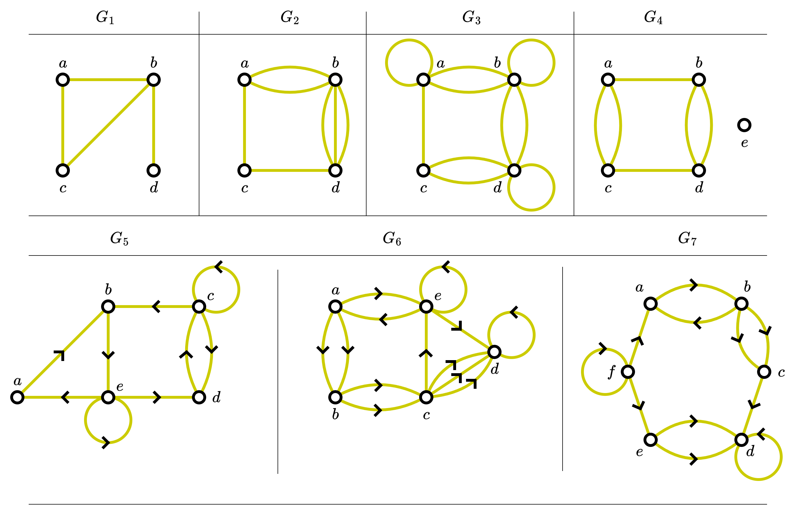

# Recitations - Graphs

Make sure you rewrite and understand the following problems and their solutions during recitations!

The following images are for problems 01, 02, and 03

 

## Problem 01

Determine whether the graphs shown above ($G_1$, $G_2$, $G_3$, $G_4$, $G_5$, 
$G_6$, and $G_7$) has directed or undirected edges, whether it has 
multiple edges, and whether it has one or more loops. Use your answer 
to determine the type of graph according to the classification
that you have learned during the class.

**Solution**: 

## Problem 02

For each undirected graph in the above graphs that is not simple, 
find a set of edges to remove to make it simple.

_Hint_: You can use a pair of two vertices for naming the edges, 
or you can add your own label to name the edge.

**Solution**: 

## Problem 03

The **intersection graph** is a collection of sets $A_1, A_2, \ldots, A_n$
is a graph that has a vertex for of these sets and has an edge connecting
the vertices representing two sets if these sets have a nonempty intersection.
Construct the intersection graph of these collections of sets.

<ol type="a">
<li>

$A_1 = \{0, 2, 4, 6, 8\}$, $A_2 = \{0, 1, 2, 3, 4\}$,   
$A_3 = \{1, 3, 5, 7, 9\}$, $A_4 = \{5, 6, 7, 8, 9\}$,  
$A_5 = \{0, 1, 8, 9\}$
<li>

$A_1 = \{\ldots, -4, -3, -2, -1, 0\}$,   
$A_2 = \{\ldots, -2, -1, 0, 1, 2, \ldots\}$,    
$A_3 = \{\ldots, -6, -4, -2, 0, 2, 4, 6, \ldots\}$    
$A_4 = \{\ldots, -5, -3, -1, 1, 3, 5, \ldots\}$   
$A_5 = \{\ldots, -6, -3, 0, 3, 6, \ldots\}$
<li>

$A_1 = \{x \mid x < 0\}$,    
$A_2 = \{x \mid -1 < x < 0\}$,    
$A_3 = \{x \mid 0 < x < 1\}$,    
$A_4 = \{x \mid -1 < x < 1\}$,    
$A_5 = \{x \mid x > -1\}$,    
$A_6 = \mathbb{R}$
</ol>

**Solution**: 

## Problem 04

**Solution**: 

## Problem 05

**Solution**: 

## Problem 06

**Solution**: 

## Problem 07

**Solution**: 

## Problem 08

**Solution**: 

## Problem 09

**Solution**: 

## Problem 10

**Solution**: 

## Problem 11

**Solution**: 

## Problem 12

**Solution**: 

## Problem 13

**Solution**: 

## Problem 14

**Solution**: 

## Problem 15

**Solution**: 

## Problem 16

**Solution**: 

## Problem 17

**Solution**: 

## Problem 18

**Solution**: 

## Problem 19

**Solution**: 

## Problem 20

**Solution**: 