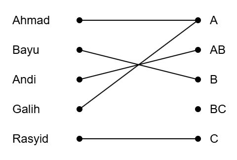
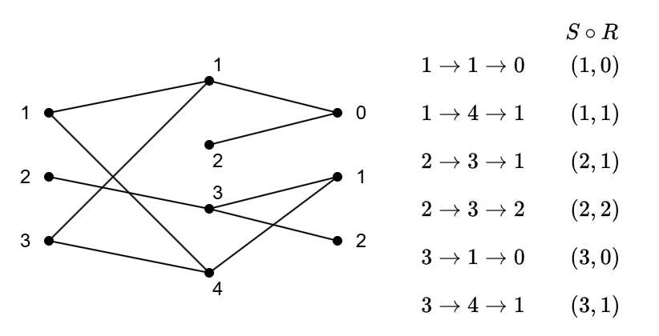

# Week 05 - Relations - Part 1

# Relations (part 01)

### Objectives:
- Understanding basic concept of relations in mathematics
- An application of relations that is heavily used in 
  technology information: Databases and SQL.


## Motivation

All domestic airports in USA. If we know there is a route between two airports
(a relation), we can decide if we can find the shortest path 
between any two airports.

## Review on functions

**Definition** (fom Section 2.3)    
Let $A$ and $B$ be nonempty sets. A _function f_ from $A$ to $B$ is an
assignment of exactly one element of $B$ to each element of $A$. 
We write $f(a) = b$ if $b$ is the unique element of $B$ assigned by 
the function $f$ to the element $a$ of $A$. If $f$ is a function from 
$A$ to $B$, we write $f: A \rightarrow B$.

_Remarks_: Functions are sometimes also called **mappings** or 
**transformations**.

**Example**:   
Suppose that each student in a discrete mathematics class is assigned 
for a ltter grade from the set $\{A, AB, B, BC, C\}$. And suppose
that the grades are A for Ahmad, B for Bayu, AB for Andi, A for Galih,
and C for Rasyid. This assignment of grades is illustrad in below




## Relations

**Definition** (product sets from Section 2.1):   
Let $A$ and $B$ be sets. The _Cartesion product_ of $A$
and $B$, denoted by $A \times B$, is the set of all 
ordered pairs $(a, b)$, where $a \in A$ and $b \in B$.
Hence
$$
  A \times B = \{(a, b) \mid a \in A \wedge b \in B\}
$$

**Example 17**  (from Section 2.1)    
What is the Cartesion product of $A = \{1, 2\}$   
and $B = \{a, b, c\}$?

**Definition**:    
Let $A$ and $B$ be sets. A _binary relation from_
$A$ _to_ $B$ is the subset of $A \times B$.

**Example**: 
- $A = \{\text{all the students in Information Systems}\}$ 
- $B = \{\text{all the courses in Information Systems}\}$
- $R = \{(a, b)\}$, where $a$ s a student enrolled in course $b$.  
  For instance:  
  $R = \{(\text{Andi, SI518}),
            (\text{Debora, SI518}), (\text{Andi, SI510})\}$

**Example**   
- $A = \{\text{all the cities in Kalimantan} \}$ 
- $B = \{\text{all the provinces in Kalimantan} \}$
- $R = \{(a, b)\}$, where $a$ is a capital city of a province $b$   
  For instance:   
  $R = \{(\text{Samarinda, Kalimantan Timur}), 
          (\text{Banjarmasin, Kalimantan Selatan}) \newline
            \qquad\quad,(\text{Pontianak, Kalimantan Barat}), 
          (\text{Tarakan, Kalimantan Utara}), \newline
            \qquad\quad, (\text{Palangka Raya, Kalimantan Tengah})\}$

**Example**  
- $A = \{0, 1, 2\}$   
- $B = \{a, b\}$
- $R = \{(0, a), (0, b), (1, a), (2, b)\}$


### Function as relations   

Write the example of function above into relations.

### Relations on a set
**Definition**: A _relation on a set_ $A$ is a relation from $A$ to $A$.

**Example**:  
- $A = \{1, 2, 3, 4\}$ 
- $R = \{(a, b) \mid a \text{ divides } b\}$ where $a \in A$, $b \in A$

**Example**: 
Consider the following relations on the set of integers:
- $R_1 = \{(a, b) \mid a \leq b\}$,
- $R_2 = \{(a, b) \mid a > b\}$,
- $R_3 = \{(a, b) \mid a = b \text{ or } a = -b\}$,
- $R_4 = \{(a, b) \mid a = b\}$,
- $R_5 = \{(a, b) \mid a = b + 1\}$,
- $R_6 = \{(a, b) \mid a + b \leq 3\}$

Which of these relations contain each of the pairs $(1, 1)$, $(1, 2)$, 
$(2, 1)$, $(1, -1)$, and $(2, 2)$?

$(1, 1)$ is in $R_1$, $R_3$, $R_4$, and $R_6$;    
$(1, 2)$ is in $R_1$ and $R_6$;   
$(2, 1)$ is in $R_2$, $R_5$, and $R_6$;   
$(1, -1)$ is is in $R_2$, $R_3$, and $R_6$; and finally   
$(2, 2)$ is in $R_1$, $R_3$, and $R_4$.

## Properties of relations
- Reflexive     
  **Definition 3**    
  A relation $R$ on a set $A$ is called _reflexive_ if $(a, a)$
  for every element $a \in A$.

  **Example**    


- Symmetric, Antisymmetry    
  **Definition 4**     
  A relation $R$ on a set $A$ is called _symmetric_ 
  if $(b, a) \in R$ wheneer $(a, b) \in R$, for all 
  $a, b \in A$.    
  A relation $R$ on a set $A$ such that for all, $a, b \in A$,
  if $(a, b) \in R$ and $(b, a) \in R$, then $a = b$ is
  called _antisymmetric_.


- Transitive     
  **Definition 5**    
  A relation $R$ on a set $A$ is called _transitive_ if whenever
  $(a, b) \in R$ and $(b, c) \in R$, then $(a, c) \in R$, 
  for all $a, b, c \in A$.

  To check transitivity, we have to list all possible pairs of $((a, b), (b, c))$.

## Combining relations

**Example 18**     
Let $A$ and $B$ be the set of all students and the set of all courses
at a school, respectively. Suppose that $R_1$ consists of all 
ordered pairs $(a, b)$, where $a$ is a student who has taken course
$b$, and $R_2$ consistst of all ordered pairs $(a, b)$, 
where $a$ is a student who requires course $b$ to graduate.
What are the relations $R_1 \cup R_2$, $R_1 \cap R_2$, 
$R_1 \oplus R_2$, $R_1 \setminus R_2$, and $R_2 \setminus R_1$?

**Definition 6** (the definition of composite relation)
Let $R$ be a relation from a set $A$ to set $B$ and $S$ a relation
from $B$ to a set $C$. The _composite_ of $R$ and $S$ is the 
relation consisting of ordered pairs $(a, c)$, where 
$a \in A$, $c \in C$, and for while there exists an element 
$b \in B$ such that $(a, b) \in R$ and $(b, c) \in S$. 
We denot the composite of $R$ and $S$ by $S \circ R$.

_Solution_: 
- The relation $R_1 \cup R_2$ consists of all ordered pairs 
  $(a, b)$, where $a$ is a student who either has taken course $b$
  or needs course $b$ to graduate, 
- $R_1 \cap R_2$ is the set of all ordered pairs $(a, b)$, 
  where $a$ is a student who has taken course $b$ and needs this 
  course to graduate,
- $R_1 \oplus R_2$ consists of all ordered pairs $(a, b)$, where
  student $a$ has taken course $b$ but does not need it to
  to graduate or needs course $b$ to graduate but has not taken it,
- $R_1 \setminus R_2$ is the set of ordered pairs $(a, b)$, where
  $a$ has taken course $b$ but does not need it to graduate;
  that is, $b$ is an elective course that $a$ has taken.
- $R_2 \setminus R_1$ is the set of all ordered pairs $(a, b)$, 
  where $b$ is a course that $a$ needs to graduate but has not taken.
  
**Example 20**    
What is the composite of the relations $R$ and $S$, where $R$ is
the relation from $\{1, 2, 3\}$ to $\{1, 2, 3, 4\}$ with
$R = \{(1, 1), (1, 4), (2, 3), (3, 1), (3, 4)\}$ and $S$ is 
the relation from $\{1, 2, 3, 4\}$, to $\{0, 1, 2\}$ with 
$S = \{(1, 0), (2, 0) , (3, 1), (3, 2), (4, 1)\}$?
  
_Solution_:    



## $n$-ary relations and their applications
### Introduction

- There is a relationship involving the name of a student, 
  the student's mahor, and the student's grade point average
- There is a relationship involving the airline, flight number, 
  starting point, destination, departure time, and arrival time of a flight.


### $n$-ary relations

**Definition**     
Suppose we have $n$ non-empty sets that we called $A_1, A_2, \ldots, A_n$.
$n$-tuple is an object consist of $n$ items that we can write as
$(a_1, a_2, \ldots, a_n)$ where the first item $a_1 \in A_1$, 
the second item $a_1 \in A_2$, ..., the $n$-th item $a_n \in A_n$.    
Note that this definition of $n$-tuple is different to the definition 
of a set with $n$ elements. For tuple, the order is matter
and each element of tuple are coming from the element of sets.

**Definition 9** (Cartesian product of more than two sets)    
The _Cartesian product_ of the sets $A_1, A_2, \ldots, A_n$, denoted by
$A_1 \times A_2 \times \cdots \times A_n$, is the set of ordered
$n$-tuples $(a_1, a_2, \ldots, a_n)$, where $a_i$ belongs to $A_i$
for $i = 1, 2, \ldots, n$. In other words,
$$
  A_1 \times A_2 \times \cdots \times A_n = 
  \{(a_1, a_2, \ldots, a_n) \mid a_i \in A_i \text{ for } i = 1, 2, \ldots, n\}
$$

**Example 19**    
What is the Cartesian product $A \times B \times C$, where 
$A = \{0, 1\}$, $B = \{1, 2\}$, and $C = \{0, 1, 2\}$?   

_Solution_: The Cartesian product $A \times B \times C$ consists of all 
ordered triples $(a, b, c)$ wher $a \in A$, $b \in B$, and $c \in C$.
Hence,
$$
\begin{align*}
  A \times B \times C = \left\{
    (0, 1, 0), (0, 1, 1), (0, 1, 2), (0, 2, 0), (0, 2, 1), (0, 2, 2), \\ \right. \\
   \left. (1, 1, 0), (1, 1, 1), (1, 1, 2), (1, 2, 0), (1, 2, 1), (1, 2, 2) \right\}
\end{align*}
$$

**Definition 1**   
Let $A_1, A_2, \ldots, A_n$ be sets. An <i>$n$-ary relation</i> on these
sets is a subset of $A_1 \times A_2 \times \cdots \times A_n$. 
The sets $A_1, A_2, \ldots, A_n$ are called the _domains_ of the
relation, and $n$ is called its _degree_.

**Example 4**    
Let $R$ be the relation consisting of 5-tuples (A, N, S, D, T)
representing airplane flight, where $A$ is the airline, $N$ is
the flight number, $S$ is the starting point, $D$ is the destination, 
and $T$ is the departure time. For instance, if Citilink airline has
a flight CTV434 from Surabaya to Balikpapan at 09:34, then
(Citilink, CTV434, Surabaya, Balikpapan, 09:34) belongs to $R$. 
The degree of this relation is 5, and its domain are the set of all
airlines, the set of flight numbers, the set of cities, 
the set of cities (again), and the set of times.

Reference: https://www.flightaware.com/live/map

### Databases and relations

Relational data model is a data model based on the concept of a 
relation.

**Table 1**: `students`
| `student_name` | `id_number` | `major`              | `gpa` |
|----------------|-------------|----------------------|-------|
| Ahmad          | 10100201    | Information systems  | 3.88  |
| Andi           | 01100304    | Physics              | 3.45  |
| Candra         | 10100301    | Information system   | 3.49  |
| Galih          | 11100401    | Informatics          | 3.45  |
| Rasyid         | 11100501    | Informatics          | 3.90  |
| Stefani        | 18100102    | Digital business     | 2.99  | 

(Silberschatz et al., 2020) - Database System Concepts, 7th Ed.   
A **database-management system (DBMS)** is a collection of 
interrelated data and a set of programs to access those data. 
The collection of data, usually referred to as the **database**, 
contains information relevant to an enterprise. 
The primary goal of a DBMS is to provide a way to store and
retrieve database information that is both _convention_ and 
_efficient_.

- **records**.   
  Each row in the above table is called record. The record are
  the entries of the database.

- **fields**.   
  Each row is made up of fields. The fields are the entries of the
  $n$-tuples

- **tables**.    
  Relations used to represent databases.    

- **attributes**.    
  Each column of the table that represents a database is called 
  attribute

- **primary keys**.    
  A domain of $n$-arry relation is called a **primary key** when the value
  of the $n$-tuple from this domain determine the $n$-tuple. That is, 
  a domain is a primary key when no two $n$-tuples in the relation have
  the same value from this domain.

  **Note**:    
  Because we can add or delete records, the property that a domain is a 
  primary key is time-dependent.

- (optional) **extension**    
  The current collection of $n$-tuples in a relation is called the 
  **extension** of the relation.

- (optional) **intension**    
  The more permanent part of a databse, including the name and attributes
  of the database, is called its **intension**.   


- **composite key**    
  When the values of a set of domains determine an $n$-tuple in a relation, 
  the Cartesian product of these domains is called a **composite key**.  


### Operations on $n$-ary relations

- Selection     
  Let $R$ be an $n$-ary relation and $C$ a condition that elements in 
  $R$ may satisfy. Then the _selection operator_ $s_C$ maps the 
  $n$-arry relation $R$ to the $n$-ary relation of all $n$-tuples from
  $R$ that satisfy the condition $C$.

- Projection     
  The _projection_ $P_{i_1, i_2, \ldots, i_m}$ where 
  $i_1 < i_2 < \ldots < i_m$, 
  maps the $n$-tuple $(a_1, a_2, \ldots, a_n)$ to the $m$-tuple 
  $(a_{i_1}, a_{i_2}, \ldots, a_{i_m})$ where $m \leq n$.

- Join     
  Let $R$ be a relation of degree $m$ and $S$ a relation of degree $n$. 
  The _join_ $J_p(R, S)$, where $p \leq m$ and $p \leq n$, is a relation 
  of degreen $m + n -p$ that consists of all $(m + n - p)$-tuples
  $(a_1, a_2, \ldots, a_{m-p}, c_1, c_2, \ldots, c_p, 
    b_1, b_2, \ldots, b_{n-p})$, where the $m$-tuple 
  $(a_1, a_2, \ldots, a_{m-p}, c_1, c_2, \ldots, c_p)$ belongs to $R$ and
  the $n$-tuple $(c_1, c_2, \ldots, c_p, b_1, b_2, \ldots, b_{n-p})$
  belongs to $S$.


**Table 2**: `gpas`
| `student_name` | `gpa` |
|----------------|-------|
| Ahmad          | 3.88  |
| Andi           | 3.45  |
| Candra         | 3.49  |
| Galih          | 3.45  |
| Rasyid         | 3.90  |
| Stefani        | 2.99  |


**Table 3**: `enrollments`
| `student` | `major`                   | `course` |
|-----------|---------------------------|----------|
| Gilang    | Environmental Engineering | TL 290   | 
| Gilang    | Environmental Engineering | KU 475   | 
| Gilang    | Environmental Engineering | FI 410   |
| Marlan    | Mathematics               | MK 511   |
| Marlan    | Mathematics               | MK 603   |
| Marlan    | Mathematics               | IF 322   |
| Silfi     | Informatics               | MK 575   |
| Silfi     | Informatics               | IF 455   |

**Table 4**: `majors`
| `student` | `major`                   |
|-----------|---------------------------|
| Gilang    | Environmental Engineering |
| Marlan    | Mathematics               |
| Silfi     | Informatics               |


**Table 5**: `teaching_assignments`
| `lecturer` | `department`        | `course_number` |
|------------|---------------------|-----------------|
| Carla      | Oceanography        | 335             |
| Carla      | Oceanography        | 412             |
| Fahmi      | Digital business    | 501             |
| Fahmi      | Digital business    | 617             |
| Gina       | Physics             | 544             |
| Gina       | Physics             | 551             |
| Rahel      | Information Systems | 518             |
| Rahel      | Mathematics         | 575             |


**Table 6**: `class_schedule`
| `department`        | `course_number` | `room` | `time`     |
|---------------------|-----------------|--------|------------|
| Information systems | 518             | G521   |  2:00 P.M. |
| Mathematics         | 575             | G502   |  3:00 P.M. |
| Mathematics         | 611             | G521   |  4:00 P.M. |
| Physics             | 544             | B505   |  4:00 P.M. |
| Digital business    | 501             | A100   |  3:00 P.M. |
| Digital business    | 617             | A110   | 11:00 A.M. |
| Oceanography        | 335             | A100   |  9:00 A.M. |
| Oceanography        | 412             | A100   |  8:00 A.M. |


**Table 7**: `teaching_schedule`
| `lecturer` | `department`        | `course_number` | `room` | `c_time`     |
|------------|---------------------|-----------------|--------|------------|
| Carla      | Oceanography        | 335             | A100   |  9:00 A.M. |
| Carla      | Oceanography        | 412             | A100   |  8:00 A.M. |
| Fahmi      | Digital business    | 501             | A100   |  3:00 P.M. |
| Fahmi      | Digital business    | 617             | A110   | 11:00 A.M. |
| Gina       | Physics             | 544             | B505   |  4:00 P.M. |
| Rahel      | Information systems | 518             | G521   |  2:00 P.M. |
| Rahel      | Mathematics         | 575             | G502   |  3:00 P.M. |


### SQL

SQL is a database query language. It is a short for Structured Query Language.


**Table 8**: `flights`
| `airline` | `flight_number` | `gate` | `destination` | `departure_time` |
|-----------|-----------------|--------|---------------|------------------|
| Garuda    | 122             | 34     | Balikpapan    | 08:10            |
| Citilink  | 221             | 22     | Jakarta       | 08:17            |
| Citilink  | 122             | 33     | Semarang      | 08:22            |
| Citilink  | 322             | 34     | Denpasar      | 08:30            |
| Garuda    | 199             | 13     | Balikpapan    | 08:47            |
| Citilink  | 222             | 22     | Jakarta       | 09:10            |
| Garuda    | 322             | 34     | Balikpapan    | 09:44            |


```sql
SELECT departure_time
  FROM flights
  WHERE destination="Balikpapan"
```

```sql
SELECT lecturer, c_time
  FROM teaching_assignments, class_schedule
  WHERE department="Mathematics"
  
```

### (optional) Association rules from data mining

