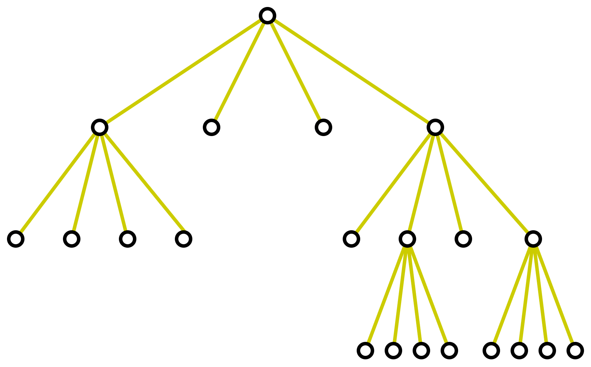

# Wekk 11 - Trees - Part 1

Useful resources:
- [(Wolfram, 2022) - Games and Puzzles as Multicomputational Systems](https://writings.stephenwolfram.com/2022/06/games-and-puzzles-as-multicomputational-systems/)

- [(Orlin, 2013) - Ultimate Tic-Tac-Toe](https://mathwithbaddrawings.com/2013/06/16/ultimate-tic-tac-toe/)

- [(Diamon, 2022) - A Practical Method for Preventing Forced Wins in Ultimate Tic-Tac-Toe](https://arxiv.org/abs/2207.06239)

## Introduction

**Subtree**

**Definition 3**   
$m$-ary tree, full $m$-ary tree, binary tree

**Trees as Models**
- Representing Organizations
- Compute File Sysmtes
- Two-Connected Parallel Processors.  
  We compare the number of process, not the number of addition.       
  [Future Demo]: demonstrate parallel computation with Fugaku

**Theorem 2**

**Theorem 3**

**Theorem 4**
This theorem gives a formula for a given number of vertices, 
number of internal vertices, or number of leaves, we have a formula
to convert between those entities

**Example 9**. 

In the textbook, the author mention that the problem is modeled by 
$4$-ary tree. Actually, if we draw the problem, it is full 4-ary tree.
One of the example for this chain message is

**Demo `networkx`**. See `/programs/trees.ipynb`

**Balanced $m$-ary trees**

**Definition of _height_ and _level_**

## Applications

### Binary search trees

**Example 1**

**Example 2**

### Decision trees

**Example 3**

**Example 4**

### Prefix codes

Huffman coding

Algorithm 2: Huffman Coding     
**procedure** _Huffman_($C$: symbols $a_i$ with frequencies $w_i$,
                        $i = 1, \ldots, n$)    
$F :=$ forest of $n$ rooted trees, each consisting of the single vertex $a_i$   
&nbsp;&nbsp;&nbsp;&nbsp; and assigned weight $w_i$    
**while** $F$ is not a tree   
&nbsp;&nbsp;&nbsp;&nbsp;
  Replace the rooted trees $T$ and $T'$ of least weights from $F$ with 
  $w(T) \geq w(T')$ with a tree having a new root that has $T$ as 
  its left subtree and $T$ as its right subtree. Label the new edge to $T$ 
  with $0$ and the new edge to $T'$ with $1$.   
&nbsp;&nbsp;&nbsp;&nbsp;
  Assign $w(T) + w(T')$ as the weight of the new tree.    
**return** the Huffman coding for the symbol $a_i$ is the concatenation of 
the labels of the edges in the unique path from the root to the vertex $a_i$

**Example 5**  

### Game trees
- Tic-tac-toe
- Chess
  Shannon number
- Rubik's cube

### Class activity
- Start with Tic-Tac-Toe game and the strategy to win
- Play Ultimate tic-tac-toe
- Explain definitions of tree and its properties.
